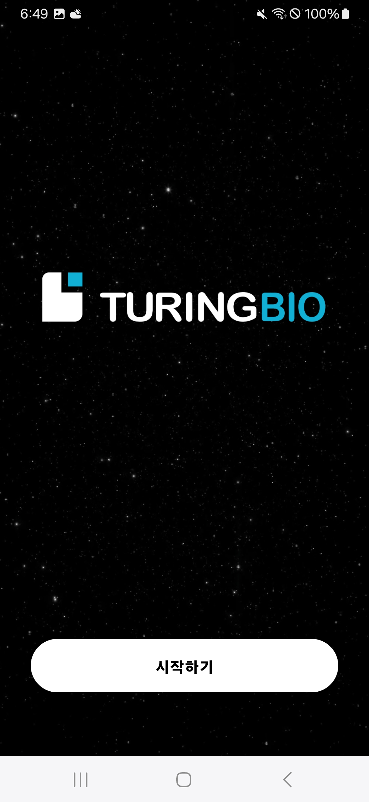
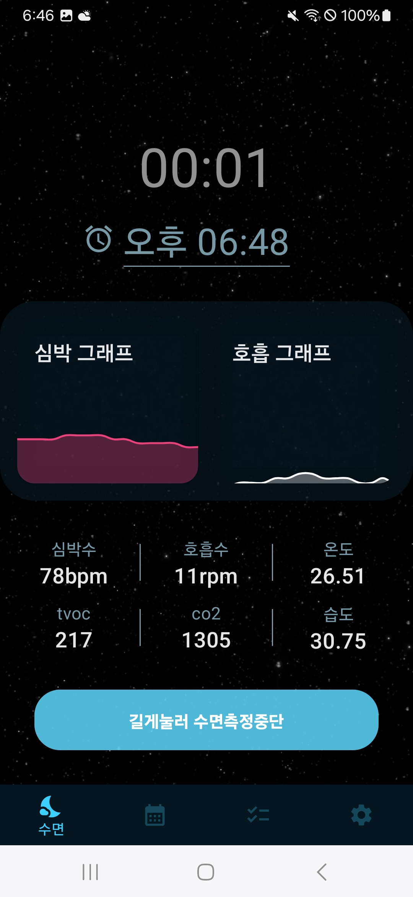
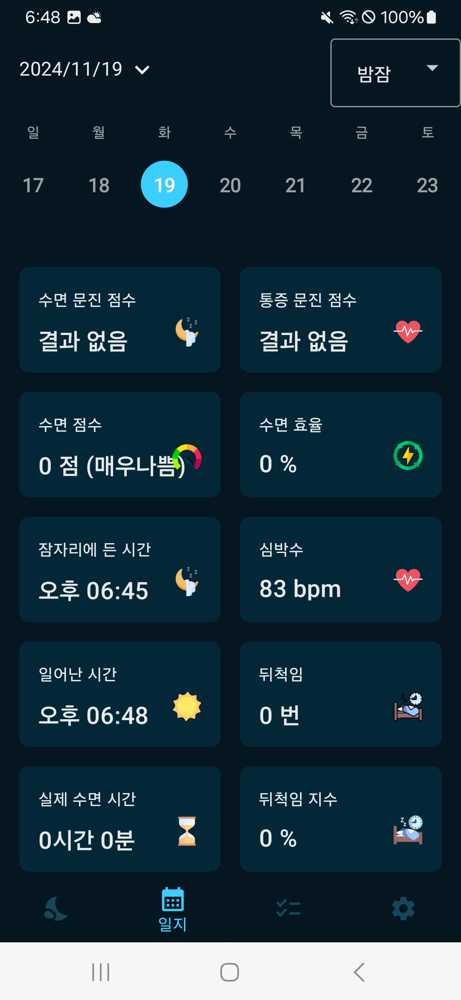
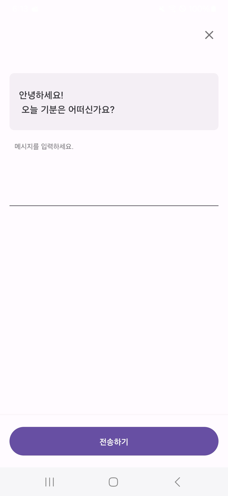

<h1 align="center">SleepMonitor</h1>  

## IntroDuction

Company : TuringBio
Desc : BLE 기반 수면 모니터링 및 분석 서비스
주요 기능 : 수면 모니터링, 수면 관련 분석, 수면 질 관련 챗봇 기능등

<table>
   <tr>
      <td>
         
      </td>
      <td>
         
      </td>
      <td>
         
      </td>
      <td>
         
      </td>
   </tr>
</table> 

### 🧑‍💻 프로젝트내 담당 업무

    
Bluetooth(BLE) 기능 개발

 <pre>
  BLE 관련 스캔 및 페이링, Controller 개발
  ㆍ Desc : 주변 Bluetooth 기기 스캔 및 페어링, 컨트롤 기능
  ㆍ Stack : BLE
</pre>
[Github Code](https://github.com/kimtaeoug/SleepMonitor/tree/main/bluetooth)

  

    
Common 및 Component 재개발

 <pre>
  ㆍ Desc : Compose 활용 Common 및 Component 재개발
  ㆍ Stack : Compose</pre>
[Github Code](https://github.com/kimtaeoug/SleepMonitor/tree/main/common)
[Github Code](https://github.com/kimtaeoug/SleepMonitor/tree/main/component)
[Github Code](https://github.com/kimtaeoug/SleepMonitor/tree/main/ui)

  

    
Notification Handler 재개발

 <pre>
  ㆍ Desc : Notification Handler 개발
</pre>
[Github Code](https://github.com/kimtaeoug/SleepMonitor/tree/main/notification)
[Github Code](https://github.com/kimtaeoug/SleepMonitor/tree/main/worker)

  

    
Api 및 Local 기능 개선

 <pre>
  ㆍ Desc : Local,Remote Repository 및 Usecase 기능 개선</pre>
[Github Code](https://github.com/kimtaeoug/SleepMonitor/tree/main/data-resource)
[Github Code](https://github.com/kimtaeoug/SleepMonitor/tree/main/data)
[Github Code](https://github.com/kimtaeoug/SleepMonitor/tree/main/local)

### ⚙️ 기술 Stack

* Architecture : AAC, CleanArchitecture, MutliPack
* Module 관리 -> MutliModule

### 협업 Tool

